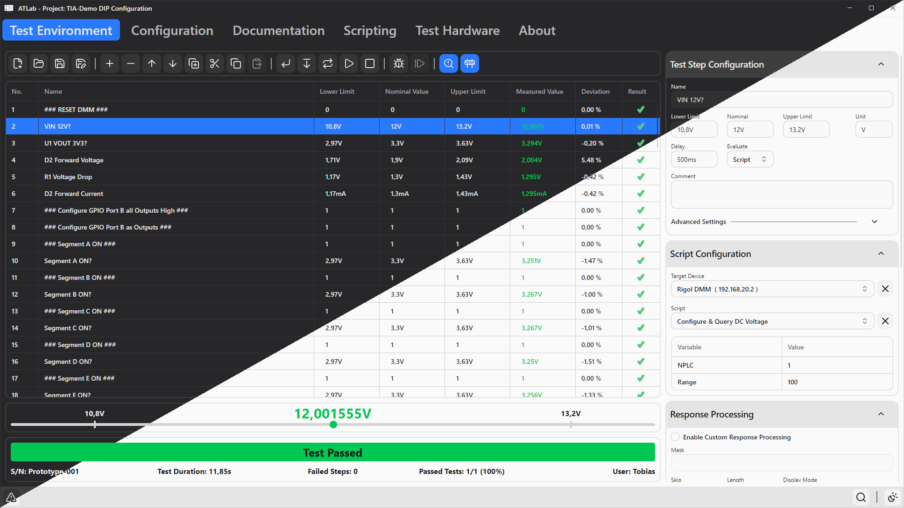
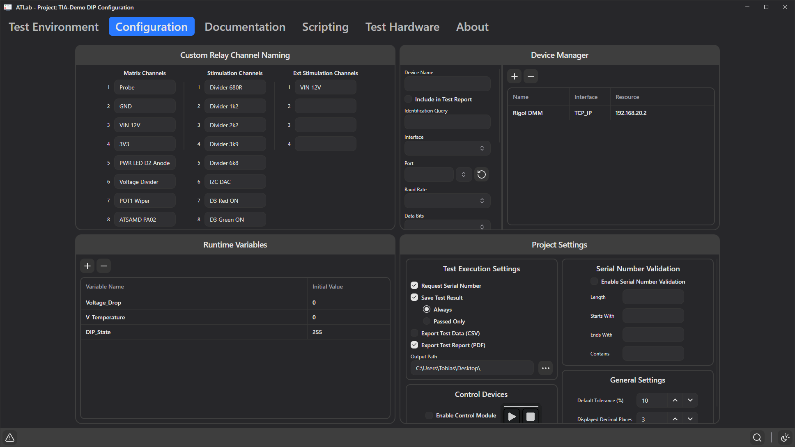
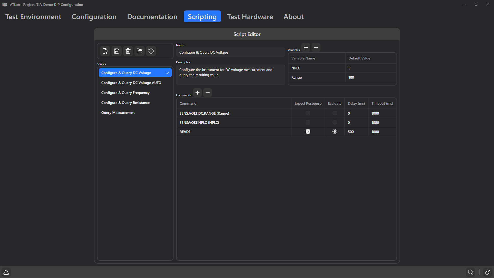
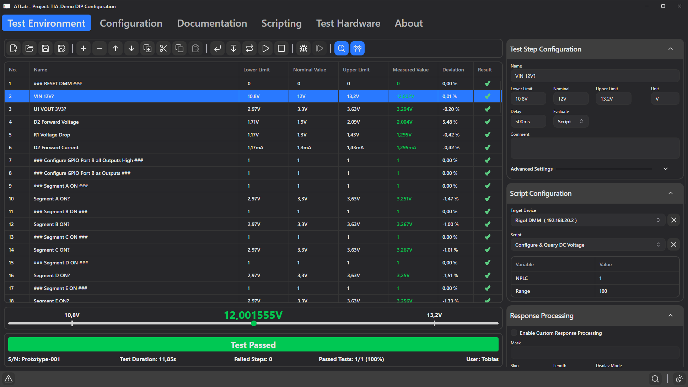
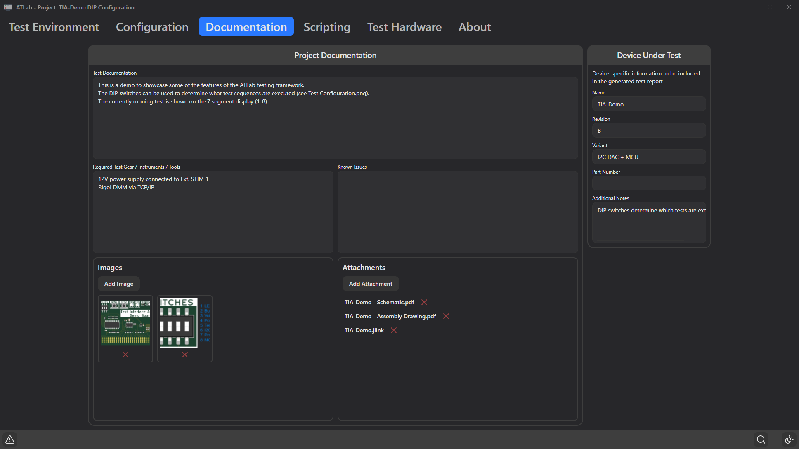
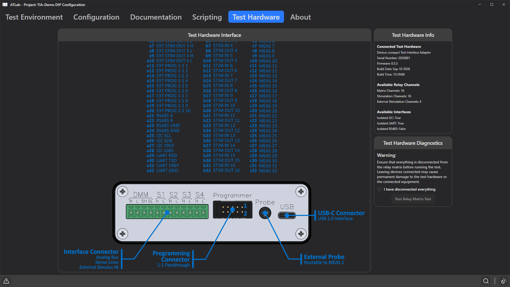

# ATLab - Automated Testing Framework


ATLab is a cross‑platform automated testing framework for interfacing with hardware through the [Test Interface Adapter](https://github.com/TobiasNetzer/TestInterfaceAdapter) and controlling external test instruments through remote control interfaces.
Built with **Avalonia UI** and **.NET**, it offers a modern environment for developing and running automated test sequences.

An example project developed with ATLab can be found [here](https://github.com/TobiasNetzer/ATLab-Examples).
## Features

-   **Custom Test Sequence Creation**: Test steps can be configured to perform various actions:
    -   **Test Instrument Remote Control**: Send custom commands or predefined scripts to remotely control external instruments (multimeter, oscilloscope, etc.).
    -   **Response Validation**: Use custom response processing to verify incoming data.
    -   **Shell Commands**: Execute local system commands or scripts.
    -   **Evaluate Runtime Variables**:
        -   **Dynamic Test Configurations**: Define and use custom variables within test scripts for dynamic test configurations.
        -   **Expression Evaluation**: Support for evaluating custom expressions to generate dynamic or calculated values.
    -   **User Responses**: Capture user input during test execution.
    -   **File Content**: Read and validate file contents from the local file system.
    -   **Relay Control**: Configure the Relay Matrix and Relay Groups, using the Test Interface Adapter, to route and switch signals to external devices.
    -   **Interface Communication**: Use the Test Interface Adapters onboard interfaces (I2C/UART) to communicate with the DUT.
    -   **Define Pass/Fail Criteria**:
        -   **Test Step Evaluation**: Define pass/fail criteria based on step results and conditions.
        -   **Conditional Test Execution**: Use pass/fail criteria to conditionally execute test steps or skip tests based on previous results.
-   **Test Instrument Interfacing**: Support for **Serial Port (VCOM/RS232)**, **TCP/IP (raw socket)** and **VISA (Virtual Instrument Software Architecture)** interfaces.
-   **Device Management**: Configure and manage multiple devices (Test Instruments or DUTs) with custom settings.
-   **Scripting Engine**: Create test sequences with predefined multicommand scripts.
-   **Test Result Exporting**: Export test results to CSV files for analysis and logging.
-   **Test Report Generation**: Automatically generate test reports with detailed test results for documentation and sharing test results.
-   **Test Documentation**: Ability to add documentation, images, and other assets to the project.
-   **JSON File Format**: All project and script files use a standard JSON file format, perfect for tracking changes through version control.
-   **Cross-Platform Support**: Runs on Windows & Linux.
-   **Themes**: Light and Dark theme available.



## Build and Prerequisites

### Prerequisites

-   **.NET 10.0 SDK** (or newer)
-   *Optional:* NI-VISA drivers (if using VISA-based instruments) **currently Windows only**

### How to Build

1.  **Clone the repository**:
    ```bash
    git clone https://github.com/TobiasNetzer/ATLab.git
    cd ATLab
    ```

2.  **Restore dependencies**:
    ```bash
    dotnet restore
    ```

3.  **Build the project**:
    ```bash
    dotnet build -c Release
    ```

4.  **Run the application**:
    ```bash
    dotnet run --project ATLab.csproj
    ```

Alternatively, you can open the `ATLab.sln` file in **JetBrains Rider**, **Visual Studio 2022**, or **VS Code** (with C# Dev Kit) and use the built-in build/run commands.

## Developing a Test Sequence

### 1. Configure Devices and Settings
-   **Hardware Setup**: The **Configuration** tab allows adding and configuring your external test instruments. You can set up **Serial Port (VCOM/RS232)** , **TCP/IP** or **VISA** devices, with custom connection parameters.
-   **Project Settings**: Configure project-wide settings such as default tolerances, serial number requirements, and test result export options.
-   **Custom channel names (optional):** Add custom channel names for the various relay channels.
-   **Runtime variables (optional):** Add Runtime Variables to use within the test.



### 2. Create Scripts
The **Scripting** tab allows you to create and edit multi step scripts that can be used within your test. Scripts are saved in a configured repository folder, making them available across different projects.
- **Create New Scripts**: Click on **New Script** to create a new script sequence.
- **Define Commands**: Add commands with specific delays and timeouts. The system is primarily designed for SCPI commands.
- **Add Variables (optional)**: Define variables within your script (e.g., `{Range}`) to make them customizable when used in different test steps.



### 3. Build Test Sequence
In the **Test Environment** tab, you can now build your test sequence.
- **Add/Edit Steps**: Use the toolbar or context menu to add, remove, copy, paste, duplicate, or reorder test steps.
- **Configure Step Parameters**: Customize step settings such as pass/fail limits and evaluation sources.
- **Assign Scripts or Commands**: For each test step, you can either select a predefined script from your repository or manually enter a command (e.g., SCPI).
- **Custom Variables**: If a script with variables is selected, you can provide specific values for that step.
- **Response Validation**: Configure expected responses and use response processing to verify the instrument output.
- **Relay Control**: Set the state of the Relay Matrix or Relay Groups for signal routing during that step.



### 4. Run Test Sequence
Once your sequence is ready, use the execution controls to run the test:
-   **Start Test**: Run the entire sequence.
-   **Start from Selection**: Begin execution from the currently selected step.
-   **Single Step**: Execute only the selected step.
-   **Repeat Test**: Run the sequence in a continuous loop.
-   **Stop**: Cancel the running test at any time.
-   **Debugging** If development mode is enabled, the debug controls will be available as well.  
Enable debug mode to step through the sequence step by step.

Depending on the project settings, a test report will be generated automatically when the test completes.
- [Test Report Example 2026-001_2026-04-21_20-57-52](docs/2026-001_2026-04-21_20-57-52.pdf)
- [Test Report Example 2026-002_2026-04-21_21-01-42](docs/2026-002_2026-04-21_21-01-42.pdf)

### 5. Documentation
The **Documentation** tab allows for adding documentation to the project.  
You can add images, descriptions, and links to external resources, so they are easily accessible within the project.



### 6. Hardware Overview
The **Test Hardware** tab provides a visual representation of the attached test hardware, as well as information about the available channels and interfaces.


